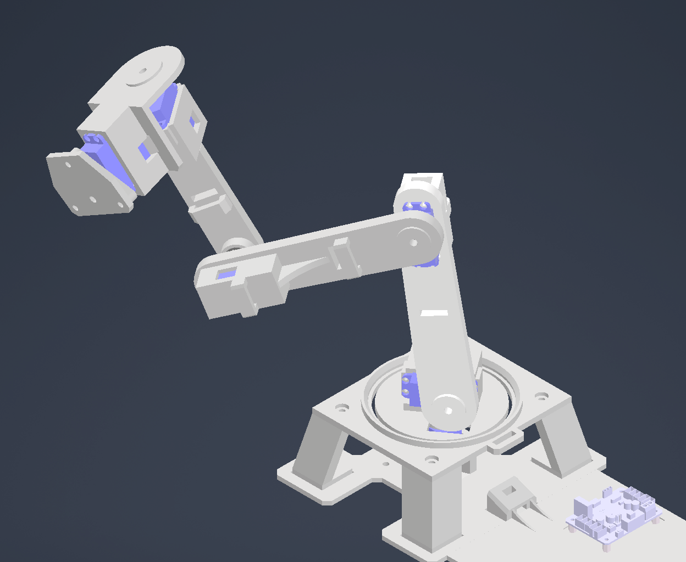

# MechanicalArmProject
Mechatronics Project - Mechanical Servo-Powered Arm - Sam Wang
  
  
### Overview:
  
Hello!
  
My name is Sam, and this is the Github Repository for my Mechanical Arm project. I am an electrical and biomedical engineering student at McMaster University, and this project is meant for me to familiarize myself with various aspects of the engineering design process through a self-guided project. I started this project in March 2026 (this Repo. was created much later), and it will be a passion project for the upcoming summer and beyond!
  
My goal is primarily to familiarize myself with embedded systems, as I aspire to become a capable embedded systems engineer. However, I will also be working with other aspects of the design process, since this is an individual project and I will be managing every aspect of this design with a strong emphasis on creating components from scratch wherever possible.
  
Some of the skills I hope to develop / continue developing on the software side include:
  
* Proficiency with Git / other version control software
* Understanding the software design process and principles of structured programming / data structures
* Problem solving and optimization strategies
* Familiarity with new Python/C++ libraries
* Recognizing how different engineering fields interact in an ecosystem and how to design around the "Big Picture"

Hopefully, this project interests you! I would love to hear any advice or recommendations from knowledgeable individuals, and I hope to gain a lot of knowledge from this journey.
  
  
  

*Above is a simple photo of an old iteration (since improved) of my mechanical arm, which was created in Autodesk Inventor.*
  
  
  
  
  
### Description of Features

Below is a list of features of this mechanical arm. Please note that items marked with a (*) are in progress or planned. Furthermore, features listed are non-exhaustive, and I will regularly update the list as new ideas are evaluated!

##### Mechanical
* Six joints providing 360° mobility across three planes.
* Modular attachment system to allow for manually changing end-attachment of the robotic arm.

##### Electrical
* Electrical infrastructure powered by 3S LiPo battery (11.1V) with custom PCBs for power management, battery monitoring, display, etc.
* Circuit protection components in event of overvoltage, overcurrent, electrostatic discharge (ESD), etc. (*)

##### Software
* Software PID controller for precise control of six servos using current and angle feedback. (*)
* Interrupt-based battery-monitoring program to manage battery health. (*)